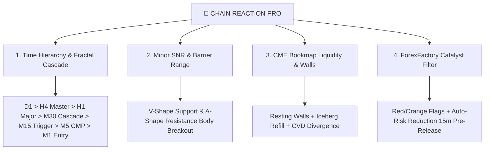

# 👑 CHAIN REACTION PRO — MASTER DOCTRINE & SYSTEM SKILL
**Author & Commander**: Dadang Wahyuono  
**System Version**: v61.02+ Institutional Suite  
**Platform**: Unified Web Portal (`http://100.71.97.6:8766/`), MetaTrader 5, Chicago CME Futures GC, Bookmap Level 2.

---

## 1. Core Trading Philosophy & The 4 Pillars



### Pillar 1: Time Hierarchy (Rantai Waktu)
* **D1 (Daily)**: Macro Bias & Institutional Swing Direction.
* **H4 (Master)**: Primary Barrier & Structural Regime (Kunci Arah Utama).
* **H1 (Major)**: Continuation & Retracement Confirmation.
* **M30 (Cascade)**: The Bridge Transition between macro and micro structure.
* **M15 (Trigger)**: Volume Aggression & Flow Alignment.
* **M5 (CMP Breakout)**: Sniper Execution Zone (Minor SNR V-Shape / A-Shape).
* **M1 (Micro Flow)**: Sub-bar lot deployment & precision trigger.

### Pillar 2: Minor SNR (V-Shape & A-Shape) Doctrine
* **V-Shape (Support)**: Sharp downward thrust immediately followed by an aggressive upward reversal bar.
* **A-Shape (Resistance)**: Sharp upward thrust immediately followed by an aggressive downward reversal bar.
* **True Breakout**: Candle body **CLOSES OUTSIDE** the Minor SNR barrier level with high volume delta.
* **Fakeout / Rejection**: Candle tests the barrier, leaves a wick (tail), and closes back inside $\rightarrow$ **NO ENTRY**.

### Pillar 3: CME Futures GC to MT5 Spot Conversion
* Chicago CME Gold Futures (`GC`) trades at a basis premium over broker Spot Gold (`XAUUSD`).
* **Basis Offset Formula**:
  $$\text{Price}_{\text{MT5}} = \text{Price}_{\text{CME}} - \text{Basis Offset} \quad (\approx \$51.82)$$
* **Dual Scale Mode**:
  - `[ 🟢 MT5 SPOT ]`: Maps all CME walls directly onto broker execution scale ($4454.xx$).
  - `[ 🟡 RAW CME GC ]`: Shows native Chicago futures scale ($4506.xx$) for pure order-flow auditing.

### Pillar 4: Bookmap Level 2 Order Flow & CVD
* **Resting Walls**: Large limit order blocks ($\ge 1000\text{ Lots}$).
* **Iceberg Orders**: Algorithmic refills detected when traded volume significantly exceeds displayed limit size ($\ge 3\text{x}$ ratio).
* **Cumulative Volume Delta (CVD)**: Measures net market aggressor buying vs selling.

---

## 2. Web Portal Architecture (`sultan/`)

The platform is served as a Unified Institutional Single-Page Portal:

```
sultan/
├── index.html / dashboard.html   # Main Master Portal (Obsidian Cyberpunk UI)
├── chart.html                    # Multi-Grid TradingView Chart Terminal (4-Grid / Quad)
├── chart-assets/
│   ├── charts/WindowManager.js   # Multi-window orchestrator, 21 TFs, indicators
│   ├── drawings/DrawingEngine.js # Touch-enabled drawing engine (Trendline, Box, Fib)
│   ├── drawings/DrawingStore.js  # Global cross-window drawing persistence
│   ├── core/App.js               # Application coordinator & event dispatcher
│   └── style.css                 # Master stylesheet & responsive mobile drawers
├── logic.js                      # Cockpit data processing & audio synthesizer alarms
├── news.js                       # ForexFactory scraper & AI fundamental catalyst
├── ff_calendar.json              # Live economic calendar cache
└── sultan_status.json            # Real-time MT5 EA status bridge
```

---

## 3. Key Operational Workflows & Controls

### 1-Click Fullscreen Chart Focus Mode
* **Trigger**: Click `[ ⛶ Fullscreen ]` in the top header or press key **`F`**.
* **Behavior**:
  - The Left Sidebar, Right Bookmap card, and Bottom 4 cards smoothly slide off-screen.
  - The Candlestick Chart expands to **100% Fullscreen (100vw $\times$ 100vh)**.
  - Floating button **`[ ⛶ RESTORE DASHBOARD (ESC) ]`** appears at top right.
  - Pressing **`Esc`** restores the full dashboard view.

### Mobile & Tablet Touchscreen Interaction
* **1-Finger Drag**: Inertial kinetic scrolling across historical candles.
* **2-Finger Pinch**: Fluid pinch-to-zoom candle scaling.
* **Price Axis Drag**: Tap and slide right vertical scale to adjust vertical candle compression.
* **Drawer Navigation**: Cockpit and Sidebar operate as slide-over drawers with touch dismiss buttons.

### Scale Switcher Persistence
* Selection is stored in `localStorage.getItem("dd_scale_mode")` (`"mt5"` or `"cme"`).
* Real-time tick stream and historical candle fetches automatically apply the selected scale mode.

---

## 4. Troubleshooting & Server Maintenance

| Issue | Root Cause | Solution |
| :--- | :--- | :--- |
| **`CONNECTING...` on Chart** | Duplicate JS variable or unhandled exception during load | Check browser console logs, validate syntax with `node -c WindowManager.js`, bump `?v=...` cache-buster. |
| **`WinError 32` Sharing Violation** | MT5 / Python file collision | Use non-blocking read with retry fallback in `sultan_dashboard_server.py`. |
| **Touch Gesture Blocked** | Overlay canvas pointer-events set to `auto` | Set `.drawing-canvas-overlay { pointer-events: none; }` unless actively drawing. |
| **Missing News Events** | Server-side ForexFactory filter | Verify `news_engine.py` is generating `ff_calendar.json`. |

---

## 5. Deployment Commands Quick-Ref

```bash
# Upload updated portal to Mini PC
python tools/deploy_live_wired_portal.py

# Verify JavaScript Syntax
node -c sultan/chart-assets/charts/WindowManager.js
node -c sultan/chart-assets/core/App.js
node -c sultan/chart-assets/drawings/DrawingEngine.js

# Test Server API Status
curl http://100.71.97.6:8766/api/status
curl http://100.71.97.6:8766/sultan_status.json
```
